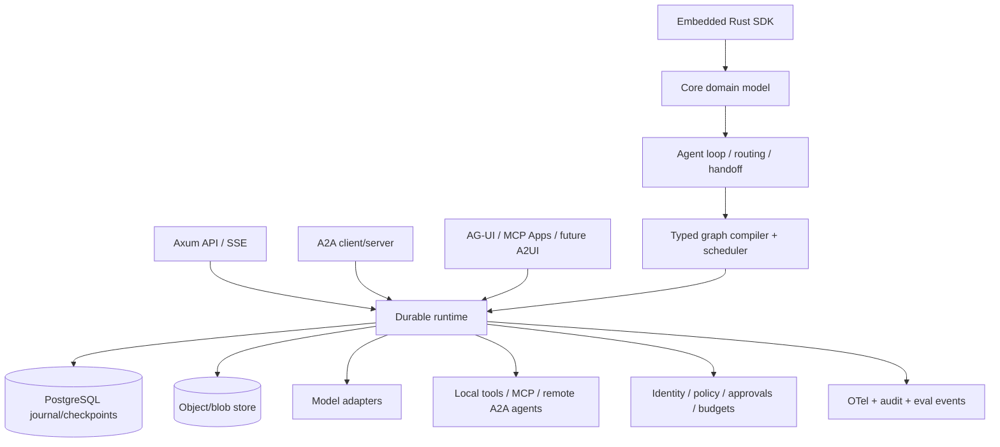

<!--
Copyright 2026 StateKnot contributors
SPDX-License-Identifier: Apache-2.0
-->

# StateKnot：Rust 生产级 Agent 框架调研与实现方案

> 状态：架构评审草案
> 调研基线：2026-08-28
> 目标：形成可长期演进、可生产部署的 Rust Agent 框架，而不是对某个 Python 框架的接口翻译。

## 1. 结论先行

项目定位为：

> **Rust-native、typed、durable、protocol-native、policy-enforced 的 Agent 应用框架与运行时。**

它应同时提供两种使用方式：

1. 作为 Rust library 嵌入业务服务；
2. 作为独立的 API/worker 服务部署，承担长任务、分布式执行、暂停恢复和协议网关。

核心决策如下：

- 不复刻 LangChain API。借鉴 LangGraph 的状态图、superstep、checkpoint 与 interrupt 语义，但重新设计 Rust 类型系统、错误模型、并发语义和持久化边界。
- 框架必须拥有自己的稳定领域模型。Rig、官方 A2A/MCP SDK、各模型 SDK 都只能位于 adapter 层，不能成为公共 API 的事实标准。
- 首发正式协议为 **MCP 2026-07-28 client/server** 与 **A2A 1.0 client/server**；协议版本必须协商、可测试、可独立升级。
- AG-UI、MCP Apps、Agent Skills 放入第二优先级；A2UI、AGNTCY/SLIM、AP2 先保留扩展点并跟踪成熟度，不能把候选规范直接固化进核心模型。
- 默认生产运行时采用 **PostgreSQL journal + checkpoint + lease/fencing + outbox**。内存实现只允许用于开发与测试。
- Restate 可作为可插拔耐久执行后端；由于 Rust SDK 仍声明可能发生破坏性变更，不应成为框架的强制依赖。Temporal Rust SDK 仍处于预发布/公开预览，也不适合作为默认基座。
- 对数据库内状态提供事务性一次提交；对外部工具副作用只承诺现实可实现的语义：**至少一次执行 + 幂等键 + 调用账本 + 可选补偿**。不宣传无法兑现的“所有工具 exactly-once”。
- 安全、可观测性、评测、成本预算、人工审批、租户隔离和崩溃恢复都属于核心能力，不是后续插件。
- 项目源代码、文档、示例与正式发布物统一采用 **Apache License 2.0（SPDX：`Apache-2.0`）**；第三方内容按其原许可证保留归属与 NOTICE，不以该许可证暗示项目隶属于 Apache Software Foundation。

## 2. 产品边界

### 2.1 v1 必须覆盖

- 文本、图片、音频、文件引用等多模态消息与 artifact；
- 模型调用、流式响应、结构化输出、工具调用与 provider capability negotiation；
- 可直接使用的 agent loop，以及 router、handoff、supervisor、agents-as-tools 等组合模式；
- typed graph、条件分支、循环、并行、join/reducer、子图、暂停/恢复、取消、重试和故障恢复；
- thread-scoped checkpoint 与跨 thread 长期 memory 的明确分离；
- PostgreSQL 持久化、多 worker 抢占、租约、fencing、事件流恢复；
- MCP client/server 与 A2A client/server；
- HTTP API、SSE 事件流、认证授权、审计、OpenTelemetry、离线/在线 eval；
- 确定性 fake model、故障注入、协议契约测试和 conformance test 集成。

### 2.2 v1 明确不做

- 低代码可视化编排器；
- 覆盖所有模型供应商、向量数据库和文档连接器；
- 自研模型训练/微调平台；
- 允许任意第三方代码在主进程内执行的插件市场；
- 在 Rust API 稳定前发布另一套 YAML/JSON DSL；
- 自研通用分布式数据库或工作流数据库；
- 把“自主发现并信任互联网上任意 Agent”作为默认行为。

这些边界不是临时妥协，而是为了让 v1 的承诺可以被测试、运维和长期维护。

## 3. 多框架调研

### 3.1 跨语言框架

| 项目 | 最值得借鉴的能力 | 不应直接照搬的部分 |
|---|---|---|
| [LangChain / LangGraph](https://docs.langchain.com/oss/python/langgraph/persistence) | StateGraph、BSP/Pregel 式 superstep、checkpoint、pending writes、interrupt、time travel、短期与长期记忆分离 | Python 动态类型、庞大兼容层、回调与配置对象扩散 |
| [Pydantic AI](https://pydantic.dev/docs/ai/core-concepts/agent/) | typed dependencies/output、模型能力声明、toolset、durable adapter、eval 与 graph builder | 依赖 Python/Pydantic 运行时的模式 |
| [OpenAI Agents SDK](https://openai.com/business/guides-and-resources/a-practical-guide-to-building-ai-agents/) | 少量核心原语、agent/tool/handoff/guardrail/tracing、易用的预置 loop | 供应商专有模型语义不能进入核心接口 |
| [Google ADK](https://google.github.io/adk-docs/) | LLM/Sequential/Parallel/Loop Agent、session/state/memory/artifact、callback/plugin、A2A/MCP、eval/deploy | 与 Google 服务绑定的部署和 provider 假设 |
| [Microsoft Agent Framework](https://learn.microsoft.com/en-us/agent-framework/) | Pregel 风格 workflow、superstep checkpoint、A2A/MCP/AG-UI，以及“跨边界才使用 A2A”的清晰原则 | 当前官方 SDK 不含 Rust；不依赖社区 Rust 移植作为核心 |
| [AutoGen](https://github.com/microsoft/autogen) | event-driven core、team/swarm/selector/magentic 等多 Agent 协作模式 | 项目已进入 community-managed maintenance，新项目被官方引导至 Microsoft Agent Framework；其状态保存与实验性 graph 也不能作为耐久语义基线 |
| [CrewAI](https://docs.crewai.com/en/concepts/flows) | role/process 的高层易用性、event-driven flow、分支/循环/HITL | “角色扮演”抽象不应替代明确的数据流、权限与执行保证 |
| [LlamaIndex](https://docs.llamaindex.ai/en/stable/) | ingestion/retrieval/query、agents-as-tools、结构化输出，是 RAG 层的重要参考 | 不在 v1 复制其庞大 connector catalog |
| [Mastra](https://mastra.ai/articles/ai-workflows) | TypeScript 下清晰的 chain/branch/parallel/suspend-resume、snapshot、OTel 与 eval 体验 | JS/TS 特有 API 形态和运行时假设 |

综合判断：没有任何一个项目同时把 Rust 类型安全、耐久执行、A2A/MCP、生产治理和易用 API 做完整。因此项目有明确价值，但差异点不能只是“Rust 版 LangChain”。

### 3.2 Rust 原生生态

| 项目 | 判断 | 本项目策略 |
|---|---|---|
| [Rig](https://rig.rs/) | 当前 Rust Agent 生态里 provider、tool、RAG 和 workflow 覆盖较全面；但仍在 1.0 前，近期持续拆分核心契约，durable pause/session 仍在演进 | 作为 API 和生态对照；v1 不引入 bridge，公共 trait 不依赖 Rig 类型 |
| [Swiftide](https://github.com/bosun-ai/swiftide) | typed task、streaming RAG、agent、MCP、HITL 和 tracing 值得参考；项目明确处于 1.0 前 | 参考 RAG pipeline 与 task ergonomics，不作为运行时基座 |
| [agent_graph](https://docs.rs/agent-graph/latest/agent_graph/) | LangGraph 风格，但版本和生态成熟度不足 | 不作为依赖，只作 API 对照 |
| [agent-framework-rs](https://github.com/CodeHalwell/agent-framework-rs) | 能力面较广，但不是 Microsoft 官方 Rust SDK | 仅作功能比较，不进入信任链 |
| [a2a-rs](https://github.com/a2aproject/a2a-rs) | A2A 官方 Rust SDK，覆盖 client/server/JSON-RPC/REST/gRPC 等 | adapter 内优先采用并锁定版本，同时用官方 TCK 防回归 |
| [MCP Rust SDK](https://github.com/modelcontextprotocol/rust-sdk) | 官方 SDK，已跟进 2026-07-28；Rust 支持仍标为 beta | adapter 内采用；禁止其 wire/domain 类型穿透公共 API；CI 跑官方 conformance suite |

### 3.3 耐久执行引擎

| 方案 | 优点 | 风险/限制 | 决策 |
|---|---|---|---|
| 自有 PostgreSQL runtime | 无外部控制面依赖；可嵌入；事务、RLS、备份、观测和运维成熟；可精确实现 graph 语义 | 调度、租约、迁移和故障测试工作量大 | v1 默认生产基线 |
| [Restate](https://docs.restate.dev/ai/patterns/durable-agents) | journal-based durable execution、signal、workflow/object、集群与生产部署能力较完整；有原生 Rust SDK | 增加独立运行时；Rust SDK 仍提示跨版本可能破坏；语义会约束框架 API | v1 预留 runtime SPI，后续提供正式 adapter |
| [Temporal Rust SDK](https://github.com/temporalio/sdk-rust) | Temporal 生态与耐久 workflow 理念成熟 | Rust SDK 仍是 public preview / prerelease | 观察，达到稳定与 conformance 门槛后再做 adapter |
| 纯内存 / SQLite | 本地开发方便 | 不支持真正的 HA、多 worker 与可靠恢复 | 仅 dev/test，文档中不得标为生产后端 |

## 4. 前沿协议地图与优先级

协议必须按职责分层，不能把所有概念塞进同一个“Agent Protocol”结构：

```text
用户/前端          AG-UI · A2UI · MCP Apps
       │
Agent 运行时       内部 Run / Event / Artifact / Interrupt 模型
       │
Agent ↔ Agent      A2A 1.0；未来可接 AGNTCY discovery / SLIM transport
       │
Agent ↔ 能力       MCP 2026-07-28 · local tools · skills
       │
领域扩展           AP2 等支付/商业协议
```

| 协议/标准 | 当前作用与成熟度 | v1 决策 |
|---|---|---|
| [A2A 1.0](https://a2a-protocol.org/latest/specification/) | Agent Card、message/task/artifact、流式、订阅、push notification；JSON-RPC、HTTP+JSON、gRPC；已有官方 Rust SDK/TCK | **P0，正式支持**。REST 与 JSON-RPC 先达到生产门槛，随后补 gRPC；实现完整 task 生命周期与 version negotiation |
| [MCP 2026-07-28](https://blog.modelcontextprotocol.io/posts/2026-07-28/) | 最新核心转向 stateless；工具 schema 使用 JSON Schema 2020-12；Task 被拆为扩展；旧 HTTP+SSE、roots/sampling/logging 等进入弃用路径 | **P0，正式支持**。client/server、tools/resources/prompts；Task extension 独立 feature；不围绕已弃用原语新增核心设计 |
| [AG-UI](https://github.com/ag-ui-protocol/ag-ui) | Agent 到用户界面的事件协议，覆盖消息、tool、state、HITL；事件集合仍演进，Rust 实现主要来自社区 | **P1，Beta adapter**。映射内部 event journal，不反向污染 runtime 语义 |
| [MCP Apps](https://modelcontextprotocol.io/extensions/apps/overview) | MCP 首个正式扩展，让 tool 返回 sandboxed interactive UI；官方称已可生产使用，但 client 支持不完全一致 | **P1**。server 端资源和安全策略先行，host renderer 单独交付 |
| [Agent Skills](https://www.anthropic.com/engineering/equipping-agents-for-the-real-world-with-agent-skills) | 可移植的 `SKILL.md` + scripts/resources，适合渐进加载程序性知识，与 MCP 互补 | **P1**。只加载受信来源；清单、权限、哈希、签名和 sandbox policy 必须进入设计 |
| [A2UI v1.0 Candidate](https://github.com/a2ui-project/a2ui/blob/main/specification/v1_0/docs/a2ui_protocol.md) | Agent 以 JSON stream 生成可更新 UI，规范仍标为 Candidate | **P2/实验**。先将其作为 artifact/event renderer，不设为稳定 API |
| [AGNTCY](https://github.com/agntcy) / [SLIM](https://github.com/agntcy/slim) | Agent directory、identity、OASF 与安全低延迟 transport；生态活跃但多项规范仍快速演进 | **P2**。预留 discovery/identity/transport SPI；不默认接入公共目录 |
| [AP2 v0.2](https://ap2-protocol.org/ap2/specification/) | Agent 支付授权、mandate、receipt 与争议证据，是领域协议而非通用 runtime 协议 | **领域扩展**。只有明确进入支付场景时实现，并要求确定性校验与签名验证 |

### 4.1 两条关键隔离规则

1. **内部 Run 不等于 A2A Task，也不等于 MCP Task。** 三者生命周期、授权范围和版本演进不同，adapter 必须显式映射。
2. **内部 Event 是唯一流式事实源。** SSE、A2A streaming、AG-UI、审计与 WebSocket 都从 append-only event journal 投影，避免多条流彼此不一致。

## 5. 生产级需求基线

### 5.1 正确性

- 相同 checkpoint、相同已记录外部结果和相同 graph version，调度与 reducer 结果必须确定；
- 并发节点按稳定键排序后进入 reducer，不依赖完成时序；
- 单个并行节点已提交结果后，即使同一 superstep 的其他节点失败也不重复执行；
- 任意等待态都可跨进程、跨 worker、跨部署重启恢复；
- cancel、deadline 与 backpressure 必须贯穿 model、tool、node 和 transport；
- graph 编译阶段拒绝不可达节点、缺失边、非法循环、未覆盖 route、schema 不匹配和不兼容版本。

### 5.2 可靠性

- run、event、checkpoint、interrupt、tool invocation、outbox 都是持久实体；
- worker 使用 lease + fencing token，过期 worker 的迟到写入必须被数据库拒绝；
- 所有跨系统通知通过 transactional outbox；consumer 以 event ID 幂等消费；
- retry 必须基于来源组件显式给出的 recovery advice，并同时受幂等性、deadline、budget、attempt limit、circuit breaker 与 policy 约束；不能从错误分类或 HTTP/gRPC 状态码单独推导；
- 支持限流、并发、深度、时长、token、费用和 tool-call 数量预算。
- caller/tenant/system/policy 等可选预算层逐维取最小值，解析后的 run budget 每一维必须有限；depth/concurrency/fan-out 用高水位，其余 usage 单调 checked 累计；未知费用和未配置币种 fail closed，不能当作零或无限；
- provider adapter 将 input 规范为包含 cached-input、output 规范为包含 reasoning 的累计总量；单次 context/output ceiling 归 ModelRequest/ModelCapabilities，不能与 run 累计预算混为一谈；

### 5.3 多租户与合规

- `tenant_id` 必须进入每个存储主键、索引、查询和 cache key；
- 认证与 scope 校验必须发生在读取 task/run 是否存在之前，避免 ID 枚举；
- prompt、工具参数、模型输出默认按敏感内容处理，日志记录采用显式 opt-in 与字段级脱敏；
- 每个外部动作可追溯到 user principal、agent、policy version、model/provider、tool version 和审批记录；
- 数据保留、导出、删除和 legal hold 通过 storage policy 实现。

## 6. 总体架构



设计上分为五层：

1. **Domain**：稳定的 content、message、artifact、model、tool、agent、run、event、error、identity 类型；
2. **Orchestration**：agent loop、typed graph、router、handoff、supervisor、HITL；
3. **Durability**：journal、checkpoint、scheduler、lease、outbox、artifact store；
4. **Interop**：providers、MCP、A2A、UI protocols、discovery；
5. **Operations**：server、auth、policy、telemetry、eval、admin 与迁移工具。

## 7. Cargo workspace 规划

项目正式名为 `StateKnot`，crate 统一使用 `stateknot-*` 前缀。仓库初始化时只创建不发布的 `stateknot` facade；其他边界要在 RFC 和第一条纵向链路验证后才落为物理 crate：

| 候选 crate | 职责 |
|---|---|
| `stateknot` | 面向用户的 facade 与受控 prelude |
| `stateknot-core` | 公共领域类型、trait、错误、ID、capability、identity 与 budget |
| `stateknot-runtime` | agent loop、typed graph、scheduler、run 状态机、journal、checkpoint 与 recovery |
| `stateknot-integrations` | 模型 provider、MCP 与 A2A adapter；用 feature 隔离重依赖 |
| `stateknot-server` | HTTP/SSE、worker、scheduler、admin、health/readiness 与 graceful drain |
| `stateknot-testkit` | fake model/tool/clock、fault injector、test store 与协议契约测试 |

只有在编译时间、依赖隔离、独立发布或 semver 边界已被真实需求证明时，才继续拆分 store、graph、protocol 或 observability crate。`stateknot-macros` 只在手写 API 稳定后加入。

建议初始基线：Rust edition 2024，MSRV 1.85（与官方 A2A Rust SDK 基线兼容），workspace 统一 lockfile，默认禁止自有 crate 中的 `unsafe`。

## 8. 核心领域模型

### 8.1 Content / Message / Artifact

- core `ContentPart` 在 v1 封闭为 `Text`、bounded `Json`、`ArtifactRef`；image、audio、file 都通过带 MIME、长度、SHA-256、来源和安全标签的 `ArtifactRef` 表达；
- 大对象只保存 tenant-scoped `ArtifactRef`，不向领域对象暴露 URI、bucket、对象键、文件路径或永久公网 URL；
- `ArtifactRef` 还必须携带 retention class、creator principal、可选的 capability + version、run/event 因果关系和有界 direct-parent lineage；只有 ID、URL、MIME 的轻量引用不满足生产审计与生命周期要求；
- media type 按 RFC 6838/9110 解析为具体而非 wildcard 的有界规范形式；声明的 MIME 和 modality 只用于协商与渲染，不能替代字节校验、内容扫描或授权；
- A2A 1.0 的 `raw`/`url` part，以及 MCP 2026-07-28 的 image/audio/embedded resource/resource link，必须先经过 body/base64/redirect 上限、SSRF/egress policy、tenant authorization、流式长度与 SHA-256 校验，再注册为 core artifact；
- `Message` 表示交互输入/输出，`Artifact` 表示任务产物，两者不能混用；
- trusted instruction 与 user/assistant/tool message 必须是不同领域类型；不能因为某个 provider 支持 `system` role 就允许外部消息进入高权限 instruction 层；
- message 必须有独立 UUIDv7 ID、run/event causation 和类型化 producer（principal、model attempt、owner-qualified capability 或 tool invocation），不能只记录一个可伪造的 role string；
- ordered message parts 采用 64 项和 2 MiB 内联 text/compact-JSON 的 core hard ceiling，adapter/provider policy 只能收紧不能放宽；
- provider 或协议未知字段只保存在 adapter 自己的有界、namespaced envelope 中，不能伪装为 core content 或绕过 schema/trust 策略；
- core durable wire 对未知安全枚举和值 fail closed；adapter 可在明确版本协商下保留未知协议字段，不能因供应商新增 event 崩溃或静默改变语义。

### 8.2 Capability / discovery metadata

协议和 provider 的最小公共交集只能固化为身份与发现元数据，不能把某一种工具
定义伪装成万能 capability：

- `CapabilityIdentity` 必须由 registry owner 的 `PrincipalIdentity` 与
  `CapabilityReference { name, version }` 组成；序列化 owner 只是可审计声明，
  不是认证或注册证明；
- `CapabilityKind` 封闭为 `model | tool | agent | workflow | application`；
- `CapabilityMetadata` 只包含 identity、kind、可选 title、必填 description、
  lifecycle、required scopes 和 bounded extensions；title 上限 256 UTF-8 bytes，
  description 上限 16 KiB，均保留原始 UTF-8、拒绝边界空白/双向格式控制/
  Unicode noncharacter 并在 Debug 中脱敏；
- lifecycle 封闭为 active、deprecated、retired；deprecated 的可选 sunset 必须
  严格晚于 announced time，替代 capability 必须 owner-qualified 且不能精确指向
  自身；sunset 不直接充当时钟策略，retired 记录可读取但不能进入新执行；
- model modalities/provider features、tool schemas/risk/resource permissions、
  A2A tags/examples/media modes/security schemes 都留在各自的 typed descriptor，
  不进入 common metadata。

这个分层来自协议实际差异：[MCP 2026-07-28 tool](https://modelcontextprotocol.io/specification/2026-07-28/server/tools)
包含 name/title/description、input/output schema 和必须按不可信处理的 annotations；
[A2A 1.0 `AgentSkill`](https://a2a-protocol.org/latest/specification/#445-agentskill)
还包含 tags、examples、input/output modes 与 security requirements；
[OpenAI function calling](https://developers.openai.com/api/docs/guides/function-calling)
和 [Anthropic tool definitions](https://platform.claude.com/docs/en/agents-and-tools/tool-use/define-tools)
又有不同名称语法、schema subset 和 strict/provider controls。adapter 必须显式、
可失败地映射；只有 tenant registry 完成 owner 认证、版本固定、policy 校验、
扩展注册校验和 attempt snapshot 后，发现数据才能参与选择或进入模型上下文。

### 8.3 Model

公共接口不能只抽象成 `prompt -> String`。`ModelCapabilities` 描述的是精确
model + adapter + API surface + endpoint binding，不是对某个模型家族永久有效的
宣传标签。同一模型通过 OpenAI-compatible、Anthropic Messages、Bedrock Converse
或不同 region/hosted endpoint 暴露的能力可能不同。

`ModelDescriptor` 只组合 `kind=model` 的 owner-qualified、version-pinned
`CapabilityMetadata` 与一个 `ModelCapabilities` 快照。StateKnot identity 是受信
tenant registry 的稳定键；provider model ID/alias、API surface、endpoint、region、
credential handle 和 adapter config 属于该键背后的版本化 execution binding，注册
时解析并在 attempt 中一同快照，不能作为可变字符串塞进 descriptor。这样既能覆盖
[OpenAI 的基本 model object](https://platform.openai.com/docs/api-reference/models/object)、
[Anthropic alias 到 model ID 的解析](https://platform.claude.com/docs/en/api/models/retrieve)、
[Gemini stable/latest/preview 的不同漂移语义](https://ai.google.dev/gemini-api/docs/models)
以及 [Bedrock ID/ARN/inference profile](https://docs.aws.amazon.com/bedrock/latest/userguide/foundation-models-reference.html)，
也不会错误宣称这些供应商字段拥有相同生命周期或语法。registry 若改变绑定或能力，
必须发布新的 StateKnot capability version；旧 attempt 继续引用旧快照。

已冻结的 capability negotiation 契约为：

- input/output `ModelModalities` 各自是非空、排序、拒绝重复的闭集，当前只包含
  text/image/audio/video/document；它只是粗粒度协商，精确 MIME、尺寸、页数、
  duration、数量和 byte 上限属于 adapter profile，不能由 modality 推导；
- streaming 独立声明；不能因为某个 provider 有 stream API 就假设所有模型或
  endpoint 都支持；
- `ModelToolCapabilities` 必须带本地可解析、version + digest 固定的 schema
  profile，并给出有限 max definitions、有限 max calls per response、支持的
  auto/none/required/specific choice 和 strict-arguments。单响应 calls 上限大于一
  才表示可接受 parallel tool calls；strict 只约束完整 tool-call item，core 仍
  必须本地解析和校验每个参数；
- structured output 分成 `unsupported | json | json_schema` 三级；只有
  `json_schema` 能携带接受的 schema profile。refusal、安全中断或 token 截断是
  独立终态，不伪装成 schema-valid success；
- reasoning 只声明是否能按请求返回 provider 生成的 readable summary。供应商为
  多轮连续性要求回传的 signed/encrypted opaque reasoning block 只能保存在有界
  adapter state，原样回传，不进入 core content、日志或 summary；
- token limit 分别记录已知的 total context、input、output ceiling。三者可分别
  unknown；unknown 对任何正数容量需求 fail closed，不能解释成 unlimited。
  input/output 各自不得超过已知 total context，但两个独立最大值不必能同时达到；
- tool calling 必须同时有 text input/output；JSON、JSON Schema 和 reasoning
  summary 必须有 text output。unsupported 状态携带活动字段、零支持容量和错误的
  profile/level 组合都在构造与反序列化时拒绝。

`ModelRequirements` 由实际 request 规范化生成，包含 modality、streaming、tool
容量/choice/strict、structured-output level、reasoning summary 和正数 token
minima。`satisfies` 返回排序、有界、非空的 `ModelCapabilityMismatch`，一次列全
所有未满足维度以及已知 available capacity；诊断 wire 自身也拒绝重复维度和
`available >= required` 的伪 mismatch。实际 tool/output schema 仍必须在本地
registry 对照 capability 中 digest-pinned profile 验证，协商不能删除不支持的
keyword 后静默降级。

已冻结的 `ModelRequest` 契约只承载多家接口都能严格映射的语义：

- 最多 32 条有序、identity 不重复的 application-controlled instruction，解析后
  内容合计不超过 8 MiB，artifact instruction 只能是 text；最多 256 条有序、
  message ID 不重复的 durable message，解析后内容合计不超过 64 MiB；
- message 的 inline JSON 按 text modality 协商；artifact 的 text/image/audio/video/
  document 可直接映射，structured-data/archive/binary 必须先由 application 或
  adapter 显式预处理，不能冒充 provider 可移植输入；
- 最多 128 个非 retired `ToolDescriptor`，按 provider-visible 本地名称规范排序并
  跨 owner/version 拒绝同名；tool choice 封闭为 none/auto/required/specific，
  specific 必须引用已提供名称；启用工具时每响应调用上限必须为 1..=1024，
  strict arguments 是独立要求；
- output modalities 非空；包含 text 时必须明确选择 text/json/json-schema，后者
  使用 digest-pinned `SchemaReference`，不包含 text 时禁止附带 text format；
- response delivery 明确为 complete/streaming，reasoning 只请求 readable summary；
  input/output token ceiling 和 content-byte ceiling 都是有限正数，前两者 checked
  求和形成协商需要的 context capacity，content 上限不得超过 64 MiB；
- wire 中保存自动派生的 `ModelRequirements` 以便审计，但反序列化必须重新计算并
  精确比对，不能信任调用方声明。所有 collection、资源上限和 unknown/duplicate
  field 在 builder 与 Serde 两条入口保持同一 fail-closed 语义。

该 wire 是内部持久化/adapter 契约，不是授权协议；结构校验不能证明 instruction
owner 或 tool descriptor 的 registry 身份。HTTP、MCP、A2A 等外部入口不得接受调用
方自报的 trusted instruction/可执行 descriptor，必须从已认证 tenant registry 解析
并固定精确版本。

core 固定单 candidate、禁止隐式 truncation，也不保存 provider conversation ID、
background/store 状态或 credential。temperature、top-p/top-k、stop、service tier 等
采样/供应商开关经注册的有界 adapter extension 传递；adapter 必须验证自己拥有的
extension，遇到不支持的值直接报错。deadline 与累计 token/cost/tool-call budget 属于
`ModelContext` 和 resolved run budget，不能混入一次 request 后绕过全局策略。

request 边界还逐项对照了多家当前一手 API，而不是用某一家字段作为所谓通用层：

- [OpenAI Responses create](https://developers.openai.com/api/reference/cli/resources/responses/methods/create)
  区分 instructions/input/tools/tool choice/output ceiling，并允许 provider 自动
  truncation，因此 core 必须显式禁用而不能继承默认行为；
- [Anthropic Messages create](https://platform.claude.com/docs/en/api/messages/create)
  使用顶层 system、messages、tools、tool choice、max tokens 和 output config，且新
  模型对 temperature/top-p/top-k 的可用组合已有差异，证明采样值不是稳定公共语义；
- [Gemini generateContent](https://ai.google.dev/api/generate-content) 分离 contents、
  system instruction、tools/tool config 和 generation config，并对 stop sequence 等
  字段给出自身限制；
- [Bedrock Converse](https://docs.aws.amazon.com/bedrock/latest/APIReference/API_runtime_Converse.html)
  分离 messages/system/tool config/common inference config，并用
  `additionalModelRequestFields` 承载模型特有字段。这正对应 core 契约加注册 adapter
  extension 的边界，而不是无类型 map 穿透整个 runtime。

已冻结的 `ModelResponse` 同样只保留能够安全归一化的交集：

- `ModelResponseProvenance` 固定 `AttemptId` 和精确的 owner-qualified model
  identity；provider model/request/response ID 只是 1..=512 bytes、无空白/控制字符的
  opaque correlation value，`Debug` 脱敏，不能用于授权、registry lookup 或重放；
- `ModelOutputItem` 在一个数组中保持 content、readable reasoning summary、tool
  proposal 的原始相对顺序。最多 256 个 content/summary、1024 个 proposal、合计
  1280 个 item，inline text/JSON/summary/arguments/每个 proposal extension 合计不超过 64 MiB；artifact
  外部 bytes 不进入内存计数，但继续受 artifact、budget、policy 和 resolver 上限；
- inline text/JSON 强制 `model + untrusted`，artifact 强制 `artifact + untrusted`。
  reasoning summary 必须由 request 显式启用；opaque/signed/encrypted thought state
  仍只保存在 adapter 的有界私有状态，不能转换成 summary；
- `ModelToolCallProposal` 只含 request 中精确的 `CapabilityIdentity`、可选且响应内
  唯一的 provider call ID、object-root `BoundedJson` arguments 和注册 extension。
  它没有 `InvocationId`；只有 schema、policy、budget、approval 和 invocation
  ledger 全部通过后，runtime 才创建真正调用；
- `ModelFinishReason` 封闭为 completed/tool-calls/output-limit/context-limit/refused/
  content-filtered/paused。tool-calls 必须至少有一个完整 proposal，其他终态禁止
  executable proposal；unknown、failed、cancelled、malformed provider 状态进入
  `ModelError`，不能映射成 completed；
- 单 attempt `ModelUsage` 必须提供 inclusive input/output；cached-input/reasoning 是
  可选 subset，缺失表示 unavailable 而不是 0，subset 不能大于 inclusive total，
  input + output checked。它与 run 累计 `BudgetUsage` 是不同类型，避免把一次调用
  冒充全局账本；
- `ModelResponse::new` 同时对 descriptor/request snapshot 做绑定校验：model
  identity、request token ceiling、output modality、reasoning opt-in、tool identity/
  choice/count 和 completed structured output 都必须一致。普通 text completion 可为空；
  completed JSON 必须恰有一个 typed `JsonContent`，JSON Schema 模式还必须携带请求的
  digest-pinned reference，且 adapter 已用本地可信 schema bytes 验证实际 value；
- Serde 只能验证资源、metadata、usage 与 finish 的内在不变量，不能认证 registry
  claim。读取 durable/remote wire 后必须调用 `validate_for(descriptor, request)`；
  adapter 的 `new` 路径会强制完成两层校验。

response/stop/usage 映射也逐项核对当前官方接口：

- [OpenAI Responses](https://developers.openai.com/api/reference/cli/resources/responses/methods/create)
  使用有序 output item，function call 与 message/reasoning item 可交错；response status
  还包含 queued/in-progress/failed/cancelled/incomplete，只有可证明的终态进入 core。
  usage 的 cached input 和 reasoning 都是 inclusive input/output 的明细 subset；
- [Anthropic Messages](https://platform.claude.com/docs/en/api/messages/create) 的
  end-turn/max-tokens/stop-sequence/tool-use/pause-turn/refusal/context-window-exceeded
  分别显式映射。inclusive input 必须由普通 input、cache creation、cache read 三类相加，
  不能把缓存命中从预算中扣掉；
- [Gemini generateContent](https://ai.google.dev/api/generate-content) 的 candidate
  finish reasons 还包含 safety、recitation、blocklist、prohibited content、SPII、
  malformed function call/response、unexpected/too-many tool calls 等。安全类可归一化为
  content-filtered；malformed/unknown 类必须失败。`promptTokenCount` 已包含 cached
  content，`totalTokenCount` 官方定义为 prompt + thoughts + response candidates，因此
  core output 为 candidates + thoughts；单列的 tool-use prompt 明细保存在注册
  extension，不能再次相加；
- [Bedrock Converse](https://docs.aws.amazon.com/bedrock/latest/APIReference/API_runtime_Converse.html)
  提供 end-turn/tool-use/max-tokens/stop-sequence/guardrail-intervened/content-filtered/
  malformed-model-output/malformed-tool-use/context-window-exceeded，以及 inclusive
  input/output/total 和 cache read/write 明细；malformed 类进入 error，cache 明细不
  改写 inclusive totals。

任何 provider-reported total 都必须与 adapter 的归一化等式一致；无法证明 inclusive
input/output 的 terminal 结果返回错误，不能用 0 填充。provider stop sequence、原始
finish/status、cache write、modality breakdown、service tier 等只可进入注册且有界的
response extension。

这些维度来自多家一手接口，而非只复刻 LangChain：

- [OpenAI model catalog](https://developers.openai.com/api/docs/models/compare) 按模型
  给出 context/output、streaming、function calling、structured output 和 image
  input；function calling 与 strict structured output 各有独立限制；
- Anthropic 分别定义
  [parallel tool use](https://platform.claude.com/docs/en/agents-and-tools/tool-use/parallel-tool-use)、
  [structured outputs](https://platform.claude.com/docs/en/build-with-claude/structured-outputs)
  和包含生成输出的 [context window](https://platform.claude.com/docs/en/build-with-claude/context-windows)；
- [Gemini Models API](https://ai.google.dev/api/models) 直接返回 input/output token
  limit 与 supported actions；
- [Amazon Bedrock model discovery](https://docs.aws.amazon.com/bedrock/latest/userguide/inference-api.html)
  按部署返回 input/output modalities 和 response streaming support，证明能力必须
  绑定 endpoint；
- MCP 2026-07-28 已弃用 Sampling，因此 v1 不以 MCP sampling preference 构造新的
  core model-selection 抽象。

provider adapter 必须把有序 instruction 映射到自身最高优先级的指令通道，并保持
顺序；durable `Message` 只包含 user/assistant/tool 语义角色，不能把外部内容提升为
instruction。无法无损保持层级、顺序、schema、finish 或 usage 约束时必须失败。

已冻结的 `ModelEvent` 不是任何供应商 SSE object 的并集，而是一套独立语义协议：

- 每个 event 绑定 `AttemptId` 和从 0 开始、严格连续的 semantic sequence；上限为
  1,048,576 个 event。provider ping、空 delta 和 framing 在编号前过滤。这个 sequence
  不是 journal `EventId` 或 SSE resume cursor；
- 事件闭集为 started、output-started、output-delta、output-completed、usage-updated、
  completed。output start 必须连续注册最终顺序位置，已注册的多个位置可以交错流式；
- start header 固定 text/JSON/artifact/readable-summary/tool-call 类型和最终 metadata。
  artifact 只传 immutable ref，不把 binary/base64 放进 core stream；
- 每个非空 delta 最多 64 KiB；text/JSON/summary/tool-arguments 类型不能混用。JSON 与
  tool 参数在 item close 前允许是 partial JSON，close 时才按原始拼接 bytes 做 bounded
  parse；tool 根必须为 object，失败或截断片段永远不能获得 `InvocationId`；
- 单 item 沿用 256 KiB 限制，active buffer 与 completed item 共同受 64 MiB response
  inline ceiling；output count、tool count 和 provider call ID uniqueness 在分配/执行前
  fail closed；
- usage update 必须是完整 cumulative snapshot，inclusive input/output 和已知 subset
  只能单调增加，已知 cached/reasoning breakdown 不得重新变为 unknown。terminal usage
  是权威值，且每次 snapshot 都受 request limit；
- `ModelEventAccumulator` 固定 attempt + descriptor + streaming request，并在收 event 前
  对完整 derived requirements 重新做 capability negotiation；任何 gap、重排、type
  confusion、资源违规或 binding 错误都会永久 poison。只有 completed event 能调用
  `ModelResponse::new` 并产生唯一终态；transport EOF 必须再经 `finish()`，不能把断流当
  成完成。provider error/cancel/unknown terminal 仍走 `Result<ModelEvent, ModelError>`，
  不伪造成成功事件。

这套交集逐项核对了当前一手流协议：

- [OpenAI Responses streaming](https://platform.openai.com/docs/api-reference/responses-streaming)
  自带 sequence number、output/content index、text/reasoning/function-argument delta，并以
  carrying full response 的 terminal event 收束；adapter 改用 core sequence 并只构造
  一次终态，避免重复保留完整 payload；
- [Anthropic streaming Messages](https://platform.claude.com/docs/en/build-with-claude/streaming)
  定义 message start、indexed content-block start/delta/stop、cumulative usage、ping 与
  error；tool input delta 明确是 partial JSON string，必须拼接后解析；
- [Gemini streamGenerateContent](https://ai.google.dev/api/generate-content#method:-models.streamgeneratecontent)
  以 SSE 连续返回 `GenerateContentResponse` chunk，而不是统一 event/sequence 体系，因此
  adapter 必须自行分配 core sequence 和有序 output lifecycle；
- [Bedrock ConverseStream](https://docs.aws.amazon.com/bedrock/latest/userguide/conversation-inference.html#conversation-inference-supported-models-features)
  使用 message/content-block start/delta/stop、message stop 与最后的 metadata usage，且
  text/reasoning/tool-use delta 共用 indexed block。adapter 必须等到 usage metadata 后再
  发唯一 core terminal。

canonical fixture 已证明 streaming state machine 最终重建的 wire 与既有 unary
`ModelResponse` 完全一致；partial content 永远不是 committed completion。pricing、
rate limit、service tier、region availability 与 provider knob 属于可变 policy/adapter
数据，不固化进模型 capability snapshot。

已冻结的 callable `Model` 边界保持 executor/runtime 中立，并把失败证据与重试策略分离：

- `BoxFuture` 只依赖 `std::future::Future`，`BoxStream` 只依赖最小的
  `futures-core::Stream`；二者均为 pinned + `Send`，core 不绑定 Tokio、HTTP client
  或任何 provider SDK；
- `ModelContext` 只暴露 tenant/run/thread/attempt identity、已验证的
  `BudgetRemaining`、cooperative `CancellationSignal`、持久化 UTC deadline 与由同一
  wall/monotonic observation 换算出的 `Instant`。相等即过期，wall clock 跳变不能延长
  在途调用；cancel 与 deadline 同时可见时 cancel 优先，但二者都不证明 provider 未处理
  或未计费；
- `CancellationObserver` 是可由具体 runtime newtype 适配的 object-safe 接口；状态必须
  单调永久，wait future 必须避免注册/取消竞争丢 wake。core 提供 never-cancelled 值供
  确定性测试，不假装它是生产 runtime 的取消源；
- `ModelError` 复用统一 `Failure`，只增加 preparation/dispatch/response/stream phase、
  精确 attempt/model binding、可选 provider model/request/response correlation ID 和
  最后一份完整 cumulative `ModelUsage`。phase 不是 retry advice，也不能推导账单或结果
  certainty；缺失 usage 仍是 unknown；
- `ModelError::validate_for` 对 context attempt、descriptor identity、request response
  mode 与 token ceiling 重新绑定。stream 中的 error 是唯一终止项，之后禁止继续产出；
  partial events 永远不能提交为 response；
- `ModelInvocationIntent` 将 exact checkpoint/node activation、完整 descriptor 与 request
  固定为一个协商并校验摘要的逻辑调用；retired binding 或 capability mismatch 在准备阶段
  fail closed。`ModelInvocation` 只允许 prepared → executing → committed/failed，失败后只有
  显式 `safe_after` 且 durable journal clock 已跨过完整 delay 才能用新 `AttemptId` 重试；
- intent、transition、record 分别使用版本化 domain-separated digest，revision/predecessor/
  journal head/attempt/response/error 全部参与绑定；恢复必须从 revision 0 用
  `ModelInvocationHistoryVerifier` 完整回放，单条尾记录不能单独证明 retry 合法；
- provider SDK 自动 retry 必须关闭，或者每次真实 exchange 前回到 runtime 创建新的
  `AttemptId` 并重新通过 deadline、budget、attempt、retry 与 policy 闸门；一个 attempt
  里隐藏多个网络调用会破坏账本、审计和限额，因此属于契约违规。

这组规则逐项核对了当前官方失败面：

- [OpenAI API debugging](https://platform.openai.com/docs/api-reference/backward-compatibility)
  提供 `x-request-id`，还允许显式的 `X-Client-Request-Id`；Responses streaming 的失败、
  cancelled 与 unknown terminal 不能伪装为成功；
- [Anthropic errors](https://platform.claude.com/docs/en/api/errors) 明确每个响应携带
  request ID，并说明 SSE 在 HTTP 200 后仍可能收到 error event；官方 SDK 默认自动重试
  transient/429/5xx，因此 adapter 必须关闭隐藏重试；
- [Vertex AI generative API errors](https://cloud.google.com/vertex-ai/generative-ai/docs/model-reference/api-errors)
  区分 cancelled、deadline exceeded、resource exhausted 与 unavailable，而
  `GenerateContentResponse.responseId` 提供响应关联；这些状态仍由 adapter 显式映射为
  `Failure + RetryAdvice`，不能仅凭 HTTP/gRPC code 推导 retry；
- [Bedrock ConverseStream](https://docs.aws.amazon.com/bedrock/latest/APIReference/API_runtime_ConverseStream.html)
  在已经建立的 event stream 内定义 model-stream/internal/service-unavailable/throttling/
  validation exception；AWS SDK 自身也有 retry 策略，因此同样受一 exchange 一 attempt
  约束。

建议 v1 只提供两个高保真第一方 adapter：OpenAI Responses/OpenAI-compatible 与 Anthropic Messages。其他 provider 在有明确用户需求和契约测试后再加入。

### 8.4 Tool

`ToolDescriptor` 是某个 owner-qualified、精确版本工具的不可变注册快照：

- common metadata 的 kind 必须为 `tool`；owner、version、required scopes、
  lifecycle 和 extension 上限沿用 8.2 的正式契约；
- input/output 使用带版本和 SHA-256 摘要的 `SchemaReference`。可信本地 schema
  registry 在注册期解析并校验 JSON Schema 2020-12；input 根必须是 object，
  provider adapter 还要检查各自支持的 schema profile，运行期不得按 URL
  临时下载 schema；
- `ToolRisk` 封闭为 `read_only | idempotent_write |
  non_idempotent_write`，`ToolIdempotency` 封闭为 `not_applicable |
  intrinsic | required_key | unsupported`；只允许 read-only/not-applicable、
  idempotent-write/intrinsic-or-required-key、non-idempotent-write/unsupported
  三组语义组合；
- status-query 表示能权威核对不明确结果，compensation 表示另有需要独立授权的
  补偿入口；二者都不是事务回滚，read-only 工具不得声明；注册 typed/erased
  adapter 时还必须验证对应入口确实存在；
- network/filesystem 只声明 `none | read_only | read_write`，另行声明 opaque
  credential 需求和 invocation-supplied dynamic code。它们只触发 policy
  要求，不能授予权限；精确 host/path/operation/credential handle 由 tenant
  executor profile 收窄；read-only 工具不得要求资源写权限；
- cancellation 只承诺 cooperative best effort；不能据此判断副作用未发生。
  每次调用允许的 progress event 数量必须是有限上限，事件只用于观察，不能提交
  成功状态；
- 每次调用必须给出正数 timeout、该工具版本的正数并发上限、正数 compact input
  byte 上限、正数 inline result byte 上限，以及成对为零或成对为正的 artifact
  count/aggregate-byte 上限；system、tenant、policy、run 和 descriptor
  各层取交集，任何层都不能放宽上层硬限制。

动态代码执行是资源/隔离要求，不是副作用风险分类；同一段动态代码仍可能只读、
幂等写或非幂等写。v1 不内置通用代码沙箱，只允许 policy 将其路由到独立受控的
sandbox executor，或直接拒绝。approval policy、价格/成本和精确资源 allowlist
属于会随 tenant、principal、参数或运营配置变化的版本化外部策略，不能固化进工具
版本描述符。MCP annotations 按规范是不可信提示，只有可信 registry 审核后的事实
才能映射进上述语义。

```rust
pub trait Tool: Send + Sync + 'static {
    type Input: serde::de::DeserializeOwned + schemars::JsonSchema + Send + 'static;
    type Output: serde::Serialize + schemars::JsonSchema + Send + 'static;

    fn descriptor(&self) -> &ToolDescriptor;

    fn call(
        &self,
        ctx: ToolContext,
        input: Self::Input,
    ) -> BoxFuture<'_, Result<ToolOutput<Self::Output>, ToolError>>;
}
```

框架拥有的 `ToolAdapter` 在注册时通过可信、离线的 `ToolSchemaRegistry` 将 Rust
类型 schema 绑定到 digest-pinned contract，并向运行时提供 object-safe
`ErasedTool`。调用时依次完成 context/descriptor/input binding、input schema、typed
decode、单次执行、output encode/schema、inline/artifact/budget/provenance 校验；任何
一步失败都保留 `InvocationId`（逻辑调用）、`AttemptId`（物理尝试）和独立的外部副作用
证据。required-key 工具的 key 只由 `InvocationId` 派生，跨 attempt 必须稳定。
runtime 可选注入的 progress reporter 绑定 exact invocation/attempt/tool，分配连续序号，
强制 completed 单调递增、total 一旦声明不可改变，并执行 descriptor event 上限；并发
emit、sink failure 或 in-flight future 被 drop 都 fail closed，不能用后续事件掩盖缺口。

[MCP tools](https://modelcontextprotocol.io/specification/2025-11-25/server/tools)
要求 server 校验输入、client 校验结构化结果，并区分 JSON-RPC protocol error 与
可反馈给模型的 execution error；
[MCP cancellation](https://modelcontextprotocol.io/specification/2025-11-25/basic/utilities/cancellation)
明确允许完成/取消竞态。因此 `isError`、超时和 cancel 都不能自动成为“写操作未发生”
证明。A2A 的 task status 与 artifact update 仍在协议 adapter 中映射为独立有序事件，
不会塞入 local tool 的 inline JSON。

local function、MCP tool、workflow-as-tool 和 remote A2A agent 都可适配为可执行 capability，但必须保留各自身份、风险和生命周期，不能假装它们完全相同。

### 8.5 RunContext

`RunContext` 必须携带且向下传播：

- tenant、principal、delegation chain、scopes；
- run/thread/trace/correlation IDs；
- deadline、cancel token、budget、policy version；
- credential resolver 的句柄，而不是明文 secret；
- clock、random source 与 invocation ledger 访问器，便于确定性测试。

### 8.6 Failure / Retry

公共组件错误组合统一 `Failure`，但不把 HTTP、gRPC、A2A 或 MCP 的 wire
error 当作核心模型。每次失败使用 UUIDv7 `FailureId`，并携带闭集
`FailureCategory`、稳定 `code`、`origin`、经过公开安全审查的单行 message、
显式 `RetryAdvice`、可选的 schema-bound bounded details 与 causal `EventId`。
私有 `std::error::Error` source chain 只留在进程内，不参与 Serde、JSON
Schema 或 Debug。

`RetryAdvice` 只有 `Never`、`SafeAfter { delay }`、`ReconcileFirst`。
`AmbiguousExternalOutcome` 与 `ReconcileFirst` 必须严格成对；不确定的外部写
结果在 status query、idempotency proof、compensation 或人工裁决前不得进入
普通 retry。类别与 retry advice 保持正交，因此同一个 `RateLimited` 也可能
因 provider 契约不完整而是 `Never`，同一个 `DependencyUnavailable` 只有来源
明确证明可安全重试时才是 `SafeAfter`。

HTTP adapter 遵循 [RFC 9457](https://www.rfc-editor.org/rfc/rfc9457)，但只把
经过 authorization/existence-hiding 后的安全字段放入 Problem Details；gRPC
status 不能自动成为重试策略。A2A 1.0 adapter 按所选 JSON-RPC、gRPC 或
HTTP+JSON binding 保留标准 code/message/details 语义；MCP 2026-07-28
adapter 必须区分 JSON-RPC protocol error 与模型可修正的 tool execution
error。所有 adapter mapping 都是显式、可失败、带 fixture/TCK 的边界。

### 8.7 Extensions

core `Extensions` 是协议中立的有界容器，而不是插件注册表。key 只接受不超过
512 bytes 的规范化 HTTPS/URN 标识或至少三段的严格小写 reverse-DNS 名称；
URI 只作为 identity，禁止运行时联网解引用。value 必须显式选择 `opaque` 或
`schema_bound`：前者永远没有可执行/授权语义，后者也只声明 digest-pinned
`SchemaReference`，必须经可信本地 registry 做 schema 校验并转换为单独的 typed
结果后才能影响行为。

v1 hard ceiling 固定为 64 entries、整个 compact map 256 KiB、每个 key 512
bytes，以及每个 value 的 `JsonLimits::DEFAULT`；调用方只能逐维收紧。空 map 合法，
重复 key、nested JSON 转义后的重复 key、未知 value variant 和超限数据全部 fail
closed。`Debug` 只输出条目数和字节统计；transport 在通用 Serde 之前还必须限制
包含空白在内的 raw body/record bytes。

[A2A 1.0](https://a2a-protocol.org/latest/specification/) 的 extension URI 在完成
Agent Card 声明、`A2A-Extensions` 协商和本地注册后，可按原 URI 映射；不支持的
scheme 留在 adapter 的有界 wire envelope 或被拒绝，不能改写 key 或自动降级版本。
[A2A governance](https://a2a-protocol.org/latest/topics/extension-and-binding-governance/)
明确其官方 HTTPS URI 是 canonical identifier，并不要求 HTTP 获取。
[MCP 2026-07-28 `_meta`](https://modelcontextprotocol.io/specification/2026-07-28/basic/index#_meta)
拥有不同的 `prefix/name` grammar 与 reserved keys，因此原始 `_meta` 始终由 MCP
adapter 保存和验证；只有显式、无碰撞的 registry mapping 可以将已协商 key 提升
为 core extension，禁止用字符串替换把 `/` 偷换为 `.`。

## 9. Agent 与 Graph 语义

### 9.1 预置 Agent loop

用户不应为最常见场景手写图。已实现的 `AgentDescriptor` 先把 owner-qualified
agent metadata、input/output schema、精确 model snapshot、有序可信 instructions、
canonical tool snapshots、结构化输出策略、loop limits 和 agent budget layer 冻结成
不可变定义。后续 `AgentBuilder<Input, Output>` 只提供 typed ergonomics，并在 trusted
schema registry 完成校验后生成该 descriptor；它不能绕过相同的 durable graph、policy、
ledger 和 checkpoint 边界。

结构化输出只保存已经解析的 `model_native | tool_call`，不把 `auto` 写入持久定义。
`tool_call` 使用框架保留的 final-output marker，它不是外部 Tool invocation，也不产生
tool ledger 或副作用。普通工具数量加 marker 不能超过 core model request 的 128 个
definition 上限。可复用 agent budget 不接受绝对 deadline；run admission 根据当次请求
和相对策略计算并冻结绝对 deadline。

已实现的 `AgentRequest` 只包含精确 input schema、bounded JSON input 和只能收紧的
request budget layer，不接受客户端伪造 tenant/run/thread/invocation/model/tool ID。
admission 在显式 clock observation 下，把 system/tenant/policy、agent、request 各层一次
解析为唯一 `ResolvedBudget`，执行 16 层硬上限、退休版本 fencing、deadline 和 compact
input byte 检查；恢复可继续读取已快照但后来 retired 的版本。

成功终态使用 `AgentResult`：它绑定 tenant/run/thread/logical invocation/精确 agent
version、`completed_at`、output schema、bounded final JSON、最多 64 个唯一 artifact ref 和
完整累计 `BudgetUsage`。提交前重新绑定 trusted admission provenance/request/descriptor/
resolved budget，并证明初始输入、最终输出、返回 artifact bytes 已入账。artifact 必须属于
同 tenant/run，但保留真实 model/tool/workflow/remote-agent producer；失败、cancel、approval
pause 和 handoff 继续作为显式 run transition，不编码成半成功结果。messages、raw model
responses、tool ledger 和审批历史只保存在有序 journal，避免 terminal result 复制一份可能
与 checkpoint 分叉的 process-local transcript。

默认 loop：

1. 组装受信指令与上下文；
2. 调用 model；
3. 验证 tool call 与参数；
4. 经过 policy/approval；
5. 并行或串行执行工具；
6. 记录结果并继续，直到得到 final output 或达到预算；
7. 对结构化输出做 schema 校验，可配置有限次数的修复回合。

handoff 与 agent-as-tool 必须保持不同语义：handoff 转移当前任务所有权，agent-as-tool
完成子任务后把控制权交还调用者。二者都由显式 graph transition/delegation record
表达并记录委派主体、scope 收窄、输入摘要与返回 artifact，不能伪装成本地普通工具成功。

### 9.2 Typed graph

```rust
pub trait GraphState: Send + Sync + 'static {
    type Update: Send + 'static;
    fn reduce(&mut self, update: Self::Update) -> Result<(), StateError>;
}

pub trait Node<S: GraphState>: Send + Sync {
    fn run(
        &self,
        ctx: NodeContext,
        state: Arc<S>,
    ) -> BoxFuture<'_, Result<NodeOutcome<S::Update>, NodeError>>;
}
```

关键语义：

- 节点读取不可变 state snapshot，只返回 update、route、interrupt 或 terminal result；
- 同一 superstep 的节点并行执行，barrier 后按稳定顺序归并 update；
- reducer 必须显式，禁止对共享 `HashMap<String, Value>` 做隐式 last-write-wins；
- loop 必须声明最大迭代或预算；
- interrupt 恢复时允许节点重入，因此 interrupt 前的副作用必须通过调用账本保护；
- subgraph 有独立 schema/version，同时共享或隔离 checkpoint 由声明决定。

### 9.3 Run 状态机

已实现的 protocol-neutral core 状态为：

```text
Pending -> Active -> Waiting -> Active
   |         |          |
   +---------+----------+-> CancellationRequested -> Cancelled
             +-----------> Succeeded | Failed
```

`Pending` 表示 admission 已提交但尚未开始语义执行；`Active` 表示允许推进，不表示
某个 worker 正持有 lease。`Waiting` 是 1–64 个同一 clock observation 原子注册的闭集：
可以包含带独立 UUIDv7、kind 和 exclusive expiry 的 approval/input/authentication/
external-signal/reconciliation interrupt，也可以包含带 inclusive due instant 的 sleep/
retry-backoff durable timer。并行条件逐个解析，只有最后一个移除后才回到 `Active`；
expiry 等值视为过期，timer 早到一律拒绝。

取消采用两阶段：`RequestCancellation` 先提交不可替换的 `Cancelled + Never` failure，
一旦该 revision 获胜，普通 success/failure 不得再提交；cleanup 或强制停止完成后才以
`ConfirmCancellation` 写入终态 usage。反之，success/failure 先提交时迟到 cancel 被拒绝。
三个终态互斥且 absorbing，时间不得倒退，revision 每次只做 checked `+1`。这比把 cancel
当一个易丢失的进程内 token 更严格，同时仍要求把取消后到达的真实 provider/tool effect
作为独立 ledger evidence 保存，绝不能伪造“副作用未发生”。

`RunLifecycle` 只负责业务状态。`AttemptId`、journal sequence、lease owner/expiry 与 fencing
epoch 仍是独立的 runtime/store 状态；worker 崩溃或换租约不制造业务状态转换。core 已实现
`RunFence`/`RunLease` 的纯值与状态契约，但只有
[RFC-0003](rfcs/0003-postgresql-durability-recovery-and-migration.md) 规定的数据库行锁、数据库
时钟和同事务条件写才具有权威性。interrupt 的 payload、action digest、required
principal/scope、resolution 和 resolver 也是独立持久实体，必须与对应 transition 在
expected revision + fencing 条件下单事务提交。

[A2A 1.0 TaskState](https://a2a-protocol.org/v1.0.0/specification/#413-taskstate)
只在 adapter 投影：`SUBMITTED/WORKING` 对应内部 pending/active/scheduler evidence，
`INPUT_REQUIRED/AUTH_REQUIRED` 对应 typed interrupt，terminal 显式映射；`REJECTED` 通常是
未创建 Run 的 admission rejection。LangGraph 的
[interrupt/resume](https://docs.langchain.com/oss/python/langgraph/interrupts) 说明恢复会从持久
checkpoint 重入，因此 interrupt 前的外部动作必须 ledger/idempotent；Temporal 将
[cancel requested 与 canceled 分成独立 history event](https://github.com/temporalio/documentation/blob/main/docs/references/events.mdx)，
而 Restate 的
[journal commit 与 epoch fencing](https://docs.restate.dev/references/architecture) 进一步说明
已提交业务步骤和 worker ownership 必须分层。StateKnot 借鉴这些不变量，但不复制任何一套
外部状态枚举。

## 10. 持久化与故障恢复

### 10.1 采用 snapshot + journal，而非重放模型随机性

LLM 与外部工具天然不确定，不能假设“重新执行得到同样结果”。正确策略是：

1. journal 记录已完成的外部结果、路由决定、审批和状态变化；
2. checkpoint 保存 superstep barrier 后的完整 state；
3. 每个并行节点的 committed write 独立保存；
4. 恢复时重用已提交结果，只调度尚未完成的节点；
5. event journal 是流式恢复与审计的事实源。

已实现的 journal core 使用稳定 `EventId` 做幂等身份、empty/exact `JournalHead` 做乐观
追加条件，以 RFC 8785 `{schema, kind, data}` bytes 计算 payload digest，再以 domain-separated
intent/event digest 绑定 tenant、run、source/fence、sequence、database observation 与前一条
event digest。`JournalChainVerifier` 可从空历史或可信 checkpoint/archive head 流式验证 suffix；
hash chain 用于发现损坏、缺失和乱序，不冒充能抵抗数据库管理员的签名证明。

### 10.2 PostgreSQL 实体基线

| 表 | 关键内容 |
|---|---|
| `runs` | tenant/run/thread、graph+version、status、budget、deadline、lease owner/epoch/expiry、输入输出摘要 |
| `run_events` | run 内连续 `seq`、stable event ID、source/fence、RFC 8785 payload bytes、schema pin、payload/intent/previous/event digests、database recorded time |
| `checkpoints` | superstep、parent、state blob/ref、state schema、graph version、hash |
| `run_attempt_claims` | run 内 tool/model 物理 attempt 的全局唯一 claim、exact kind/invocation/revision 与 journal anchor |
| `node_attempts` | node、attempt、input hash、status、pending/committed update、错误与时间 |
| `tool_invocations` + `tool_invocation_revisions` | immutable intent/descriptor/input、exact checkpoint+journal anchor、hash-linked revision、logical invocation/physical attempt、prepared/executing/committed/failed/unknown、结果/错误与 reconcile evidence |
| `model_invocations` + `model_invocation_revisions` | negotiated immutable descriptor/request、exact checkpoint+journal anchor、hash-linked revision、logical invocation/physical provider attempt、prepared/executing/committed/failed、完整 response/error/usage evidence |
| `interrupts` | kind、payload、required principal/scope、expiry、resolution 与 resolver |
| `outbox` | 需要可靠发送的 push/webhook/event，含 retry 与 delivery 状态 |
| `artifacts` | metadata、BlobRef、hash、provenance、retention 与 security label |

所有主键至少包含 `tenant_id`。大模型内容、图片和文件不直接无限写入 JSONB；超过阈值转到 S3-compatible blob store，并做 hash、MIME、大小和访问策略校验。
具体 append 幂等顺序、`SELECT ... FOR UPDATE`、lease claim/renew/release、corruption quarantine、
archive anchor、expand/contract migration 与 backup/restore 门禁以
[RFC-0003](rfcs/0003-postgresql-durability-recovery-and-migration.md) 为准。

当前已落地 `stateknot-store-postgres` 的第一段最终持久化边界：`runs`、`run_events`、
immutable `run_checkpoints`、immutable/hash-linked tool/model invocation ledger、run-wide
tool/model physical-attempt registry、immutable pending node-result ledger、canonical bytes/digests、
projection-bound 与 semantic-result idempotency、locked pure transition、exact-head/parent append、数据库时钟 lease/fencing、完整 journal cursor
分页、有界 reverse checkpoint-lineage 与 invocation-history 分页、未结算 invocation 的
exact-checkpoint advancement guard、精确 migration checksum/startup refusal，以及 PostgreSQL
16/17 的 v3 Attempt 回填、corruption、rollback、lost-ack、delayed retry、100 并发 journal
appender、24 并发 checkpoint writer、24 并发 tool/model invocation writer 和 24 并发 pending-result writer 测试。该 guard
只防止 checkpoint 越过未结算外部调用；pending-result 已证明 node 对 exact committed
invocation 的引用，但尚未把结果原子消费进 successor checkpoint。它不是完整 runtime。
atomic result barrier、node attempt、interrupt/outbox、自动
quarantine、recovery
scheduler、角色隔离、归档、failover 与 restore 仍按 RFC 门禁继续实现，RFC-0003 因此保持 Draft。

### 10.3 可以承诺的执行保证

| 范围 | 保证 |
|---|---|
| 数据库内 run/event/checkpoint 转换 | 单事务、幂等、fencing 后的一次提交 |
| 已提交 model response | 恢复时不再次向 provider 请求 |
| 只读 tool | 可配置安全重试 |
| 支持 idempotency key 的写 tool | 至少一次调用、一次业务效果取决于对端幂等实现 |
| 不支持幂等的外部写操作 | 可能处于 `unknown`；必须人工确认、查询对端状态或运行补偿，不能盲目重试 |
| SSE/A2A push/webhook | 至少一次投递；consumer 以 event ID 去重 |

### 10.4 代码升级

- 每个 run 固定 `graph_id + graph_version + state_schema_version + provider/tool versions`；
- 新部署只接新 run，旧部署 drain 旧 run；
- 长期等待 run 通过显式 migration 升级，migration 本身可审计、可回滚、可测试；
- 不允许在相同 graph version 下修改节点语义后直接继续历史 run。

## 11. 协议实现细节

### 11.1 MCP

- 同时支持 client 与 server；本地工具和 graph/workflow 可暴露为 MCP tools；
- 以 2026-07-28 stateless core 为主线，每个请求携带自描述路由信息；
- tools 输入输出完整支持 JSON Schema 2020-12；
- transport、auth、capability 与 extension 分离；
- OAuth issuer/resource 绑定、token audience、redirect 与 metadata 必须严格校验；
- Tasks 作为独立 extension 映射，不混入内部 Run；
- 对旧客户端只提供明确版本的 compatibility profile，不围绕已弃用 HTTP+SSE、roots/sampling/logging 增加新核心依赖；
- CI 必须运行[官方 MCP conformance suite](https://github.com/modelcontextprotocol/conformance)，并保存版本化报告。

### 11.2 A2A

- 实现 Agent Card、signed/extended card、message、task、artifact、stream、subscription、cancel、push config；
- `/.well-known/agent-card.json`、`A2A-Version`、supported interfaces 顺序与认证声明符合规范；
- REST/HTTP+JSON 与 JSON-RPC 首先达到正式门槛；gRPC 在同一领域映射稳定后加入；
- push notification 使用 outbox、签名、重试、event ID 与 receiver 幂等；
- 所有 task 查询先校验 tenant/principal/scope，再访问数据；
- file URL、webhook、card URL 都通过 SSRF 防护与重定向复核；
- CI 必须运行[官方 A2A TCK](https://github.com/a2aproject/a2a-tck)，每个声称支持的 transport 都要通过 MUST 项。

### 11.3 内部事件模型

第一版应覆盖：

- `RunStarted` / `RunStateChanged` / `RunCompleted`；
- `NodeStarted` / `NodeProgress` / `NodeCompleted` / `NodeFailed`；
- `MessageStarted` / `MessageDelta` / `MessageCompleted`；
- `ToolCallRequested` / `ToolCallProgress` / `ToolCallCompleted`；
- `StateSnapshot` / `StateDelta`；
- `ArtifactAdded` / `ArtifactDelta`；
- `InterruptRequested` / `InterruptResolved`；
- `UsageRecorded` / `PolicyDecision` / `ErrorRaised`。

每个 event 有 `event_id`、run 内单调 `seq`、causation/correlation、timestamp、schema version 和 redaction metadata。客户端可用 `Last-Event-ID` 恢复，无需重新开始 run。

## 12. Memory 与检索边界

必须分开三种状态：

1. **Graph state/checkpoint**：保证当前 run 正确恢复；
2. **Conversation/thread memory**：同一会话的短期上下文；
3. **Long-term knowledge/memory**：跨 thread 检索，带 provenance、ACL、TTL 和更新策略。

M0 范围决策已经将内建 RAG ingestion、vector database adapter、chunking 和 connector catalog 排除在 v1 之外。v1 不预先创建 `DocumentStore`、`Embedder`、`Retriever`、`Reranker` 或 `MemoryStore` 公共 trait；检索与长期知识通过普通 local tool 或 MCP tool 接入，并遵循相同的 schema、policy、provenance、budget 和审计规则。只有生产场景证明工具边界不足时，才通过新 RFC 设计最小的长期 memory/RAG API。

任何被检索内容都视为不可信数据：带来源与信任标签进入 prompt，不得提升为 system/developer instruction。外部长期 memory 写入需经过工具 policy，敏感结论可要求审批；调用证据必须支持过期、撤销和污染追踪。

## 13. 安全架构

安全基线采用 [OWASP Top 10 for Agentic Applications 2026](https://genai.owasp.org/resource/owasp-top-10-for-agentic-applications-for-2026/) 与 [NIST AI RMF GenAI Profile](https://www.nist.gov/publications/artificial-intelligence-risk-management-framework-generative-artificial-intelligence)；不是发布前才补一轮扫描。

| 风险 | 强制控制 |
|---|---|
| Agent Goal Hijacking | 指令层级与来源标签、外部内容 taint、关键目标不可由普通数据覆盖、对抗 eval |
| Tool Misuse | 最小权限、参数 schema/业务校验、风险分类、allowlist、审批、预算 |
| Identity & Privilege Abuse | end-to-end principal/delegation、scope 收窄、短期凭证、tenant 隔离 |
| Agentic Supply Chain | lockfile、SBOM、签名/摘要、依赖审计、skills/MCP/A2A 来源策略 |
| Unexpected Code Execution | 独立 executor/sandbox 进程、无默认 shell、网络/文件/secret capability 显式授权 |
| Memory & Context Poisoning | provenance、ACL、信任标签、TTL、写入审批、撤销和污染审计 |
| Insecure Inter-Agent Communication | TLS、认证、card/signature 校验、schema、replay protection、allowlist |
| Cascading Failures | depth/fanout/concurrency/cost/time budgets、circuit breaker、kill switch |
| Human-Agent Trust Exploitation | 审批界面展示准确动作、目标、参数、风险与来源；禁止模糊确认 |
| Rogue Agents | 不可被模型修改的 policy boundary、运行时终止权、不可变审计、行为检测 |

额外要求：

- URL 获取统一经过 egress policy：DNS 解析后校验、阻止 loopback/link-local/private ranges、限制重定向、响应大小、MIME 与超时，防 SSRF/DNS rebinding；
- secret 只以 opaque handle 进入运行时，按调用即时解析，永不进入 prompt、checkpoint 或普通日志；
- 工具执行器默认进程隔离；高风险代码执行使用容器/microVM adapter，CPU/内存/磁盘/网络/系统调用均有限额；
- approval token 绑定 run、具体 action hash、principal、scope、expiry 与 nonce，不能跨动作复用；
- Agent Card、skill、tool spec、prompt template 和 policy 都需版本与 provenance。

## 14. 可观测性与评测

### 14.1 Telemetry

采用 W3C Trace Context 与 OpenTelemetry。GenAI semantic conventions 仍在发展，因此框架保存自己的稳定语义版本，再映射到 [OpenTelemetry GenAI conventions](https://github.com/open-telemetry/semantic-conventions-genai/blob/main/docs/gen-ai/README.md)。

每个 run 至少记录：

- graph/node/tool/model span 与 causality；
- queue、model、tool、checkpoint、approval 各阶段 latency；
- input/output/cache/reasoning token 与已知费用；
- retry、rate limit、timeout、cancel、policy deny、schema repair；
- model/provider/prompt/tool/graph/policy 版本 fingerprint；
- 内容日志开关和 redaction 结果。

### 14.2 Eval

StateKnot 的 eval 模块必须支持：

- versioned dataset 与不可变 test case；
- exact/schema/rule/custom/LLM-judge evaluator；
- trajectory/tool-selection/policy/cost/latency 指标；
- fake model 的确定性单元测试；
- provider cassette 的契约回归，敏感数据清理后才能入库；
- golden trace、A/B、baseline comparison 和置信区间；
- prompt injection、memory poisoning、tool misuse 与跨 Agent spoofing 的安全回归集。

LLM judge 不能作为唯一发布门禁；关键业务结果必须有确定性断言或人工标注基线。

## 15. Server 与部署形态

### 15.1 对外 API

建议稳定资源 API：

```text
POST   /v1/runs
GET    /v1/runs/{run_id}
POST   /v1/runs/{run_id}:cancel
POST   /v1/runs/{run_id}:resume
GET    /v1/runs/{run_id}/events
GET    /health/live
GET    /health/ready
```

协议端点由各 adapter 按规范暴露，不强行套进 `/v1/runs`。API 使用幂等键、明确 deadline、分页、ETag/版本和 RFC 9457 风格问题详情；SSE 支持断线续传和 bounded buffer。

### 15.2 进程角色

同一 binary 支持受控角色：

- `api`：认证、提交、查询、流式与协议入口；
- `worker`：抢占 runnable run/node，执行并提交结果；
- `scheduler`：处理 sleep、retry、lease recovery、outbox；
- `all-in-one`：单节点开发或低规模生产，但仍使用正式 PostgreSQL 语义。

生产环境支持多副本、graceful drain、readiness、连接池隔离、数据库迁移锁、备份恢复演练和滚动升级。单进程内存模式不得出现在生产部署示例中。

## 16. 依赖与兼容策略

- 公共核心类型尽量依赖 `serde`、`schemars`、`futures-core`、`thiserror` 等小而稳定的库；
- Tokio 是默认 runtime，但不把 `tokio::` 类型暴露到最核心 trait；
- HTTP 使用 Rustls 默认，禁止无验证 TLS；
- provider/protocol/数据库依赖按 feature 隔离，CI 覆盖 minimal/default/all-features；
- workspace 精确管理依赖版本并提交 `Cargo.lock`；
- 使用 `cargo deny`、`cargo audit`，关键依赖可引入 `cargo vet` 审核记录；
- public API 通过 `cargo-semver-checks`，协议 fixture 与数据库 schema 单独版本化；
- 每个正式 feature 有最小支持版本、兼容矩阵、弃用周期和迁移指南；
- 官方 SDK 发生破坏性升级时只影响 adapter crate，不能迫使核心用户立即迁移。

### 16.1 Apache-2.0 开源策略

- 根目录保存 Apache License 2.0 官方全文 `LICENSE`，并维护只包含必要归属信息的 `NOTICE`；
- 所有自有 crate 的 `Cargo.toml` 使用 `license = "Apache-2.0"`，同时填写 repository、documentation、readme、rust-version 与 categories；
- 自有源代码、文档和配置文件使用简短的 copyright + SPDX header；自动生成文件在生成器与产物清单中声明，不重复堆叠无意义 header；
- 贡献默认依 Apache License 2.0 第 5 节进入项目。首期建议使用 DCO sign-off；只有在基金会、公司法务或专利治理确有要求时再引入 CLA；
- `cargo-deny` 设置第三方许可证 allowlist，Apache-2.0/MIT/BSD/ISC 等宽松许可证可自动通过，copyleft、source-available、未知或自定义许可证必须人工评审；
- crates.io 包、源码归档、Docker/OCI 镜像和其他二进制发布物都必须携带适用于其实际内容的 LICENSE、NOTICE、第三方归属、SBOM 与 provenance；
- 项目名称、Logo 与商标另行治理。Apache License 2.0 不授予商标权，也不表示项目由 Apache Software Foundation 托管或背书；
- 开源仓库在首次公开发布前必须具备 `README.md`、`CONTRIBUTING.md`、`CODE_OF_CONDUCT.md`、`SECURITY.md`、`GOVERNANCE.md`、`CHANGELOG.md`、`NOTICE`、issue/PR 模板和发布签名说明。

## 17. 实施路线图

下面按“每阶段都满足其范围内的生产质量门槛”规划，不发布一次性过渡实现。

### 阶段 0：架构契约与纵向验证（2–3 周）

- RFC：领域模型、错误分类、graph 语义、durability guarantees、protocol mapping、安全边界；
- 打通一条真实纵向链路：HTTP/SSE → durable graph → model → MCP tool → checkpoint → approval interrupt → resume → A2A remote agent → artifact；
- PostgreSQL 故障注入验证：进程在 model、tool、node commit 和 barrier 前后崩溃；
- A2A/MCP 官方 TCK 在 CI 中跑通最小实现；
- 只有达到后续质量标准的代码才进入主干，验证失败的设计直接修改 RFC，而不是保留两套 API。

### 阶段 1：稳定核心与 Agent API（4–5 周）

- `stateknot-core`、`stateknot-runtime`、`stateknot-testkit`；
- 多模态 content、capability negotiation、structured output、streaming；
- OpenAI/Anthropic 第一方 adapter、local tool、policy middleware；
- fake model/tool/clock、provider cassette、单元与契约测试。

### 阶段 2：Typed graph 与调度器（5–6 周）

- graph compiler、parallel/join/reducer/route/loop/subgraph；
- 确定性 superstep、pending writes、cancel/deadline/retry/budget；
- property tests、并发压力测试与 model checker 覆盖关键状态机。

### 阶段 3：PostgreSQL 耐久运行时（5–6 周）

- journal/checkpoint/node attempts/tool ledger/interrupt/outbox；
- lease/fencing、多 worker、恢复与版本迁移；
- testcontainers、kill/restart、网络分区和数据库 failover 测试；
- blob store、retention、tenant isolation 与 RLS 可选配置。

进度：run/journal/checkpoint/tool/model-invocation/lease、run-wide physical-attempt registry、
pending node-result 核心契约及 PostgreSQL immutable commit/load ledger 已完成并通过 PG16/17
验证；atomic pending-result barrier、node-attempt ledger、recovery scheduler、outbox，
以及阶段 3 的其余运维与故障门禁未完成，不能据此提前宣称阶段完成。

### 阶段 4：协议正式支持（4–5 周）

- MCP client/server 及 conformance；
- A2A REST/JSON-RPC、card/task/artifact/stream/push 及 TCK；
- OAuth/TLS/SSRF/push outbox/签名；
- 保存 AG-UI 等后续协议的映射约束，v1 不创建对应 feature 或公共 API。

### 阶段 5：生产治理与发布候选（4–6 周）

- server/API、OTel、eval、安全回归、限流/熔断、admin/运维；
- 升级、备份恢复、灾难演练、性能与 soak test；
- API 稳定性审查、文档、示例、兼容矩阵、Apache-2.0 归属核验、SBOM 与发布签名；
- 至少两个不同业务场景的 production pilot。

人员估算：3–4 名资深 Rust/分布式系统工程师，加兼职安全、SRE 与评测支持，完整 v1 约 **24–32 个自然周**。单人实现并达到同等生产门槛，现实估算为 **12–18 个月**。如果先交付受限范围的首个生产版本，可以固定 provider、只做 A2A REST/JSON-RPC、暂缓 UI 协议，但不能降低持久化、安全和测试门槛。

## 18. 发布门禁

### 18.1 正确性与恢复

- 对所有持久状态机做 property/state-machine tests；
- 在每个持久化边界注入 crash，恢复后无已提交节点重复执行、无 event 丢失、无非法状态跃迁；
- 证明 fencing 能拒绝过期 worker 写入；
- reducer 在不同任务完成顺序下结果一致；
- 长时间运行 soak test 无任务泄漏、连接泄漏或无界内存增长。

### 18.2 协议

- A2A：每个正式声明的 transport 通过官方 TCK 的 MUST 项；
- MCP：client/server 通过官方 conformance core profile；
- 保存报告、规范版本、SDK 版本与例外清单；有例外就不能标记为完整支持；
- 对未知字段、乱序/重复事件、断流恢复、超大 payload 和恶意 URL 做 fuzz/negative tests。

### 18.3 工程与供应链

- MSRV/default/all-features、Linux/macOS、PostgreSQL 支持矩阵 CI；
- `fmt`、Clippy `-D warnings`、docs、semver checks、deny/audit/vet；
- 协议 parser、URL/security boundary 和状态机 fuzzing；
- release artifact 可复现、签名、SBOM、provenance；
- `cargo package`、源码归档和 OCI 镜像均验证包含正确的 LICENSE、NOTICE 与第三方归属；
- 无未解释的 `unsafe`，无明文 secret fixture，默认日志通过敏感数据检查。

### 18.4 性能与 SLO

在选定参考硬件与数据库规格后冻结 SLO，而不是给无上下文的营销数字。至少测量：

- runnable node 吞吐与 scheduler p50/p95/p99 延迟；
- 事件写入/订阅吞吐、SSE 慢消费者与重连；
- checkpoint 大小、写放大、恢复时间；
- 并发 active/suspended runs；
- provider 限流、tool timeout、数据库 failover 下的退化行为；
- 每 run 的数据库、存储、token 与网络成本。

## 19. 主要风险与处理

| 风险 | 影响 | 处理 |
|---|---|---|
| 前沿协议快速变更 | 公共 API 被 wire spec 拖着变化 | adapter 隔离、版本协商、fixture/TCK、正式/Beta 分级 |
| 框架范围失控 | 长期无法交付稳定版本 | 固定 v1 non-goals；provider/vector/UI 插件按门禁逐个加入 |
| 自有 durable runtime 复杂 | 并发与恢复 bug 风险高 | PostgreSQL 单一事实源、明确状态机、fencing、outbox、故障注入与形式化/模型测试 |
| Rust provider 生态仍在 1.0 前 | 上游破坏性升级 | 自有 trait、adapter pin、两家 provider 第一方实现；其他 bridge 延后 |
| 外部副作用无法 exactly-once | 重复支付/邮件/变更 | 风险分类、幂等键、调用账本、unknown 状态、审批和补偿 |
| prompt/skill/tool 供应链攻击 | 数据泄漏或越权执行 | provenance、签名、最小权限、sandbox、egress policy、安全 eval |
| 长 run 跨版本升级 | 无法恢复或语义漂移 | 固定 graph/version、deployment drain、显式 state migration |
| “通用抽象”丢失 provider 特性 | 性能和能力受限 | capability negotiation、extensions、第一方高保真 adapter |

## 20. 建议优先确认的产品决策

若没有额外业务约束，建议采用以下默认值继续实现：

1. 首个目标场景：企业内部工具型 Agent 与跨服务 Agent 协作，不先做开放互联网 Agent 市场；
2. 首批模型：OpenAI Responses/OpenAI-compatible + Anthropic；
3. 首批持久化：PostgreSQL 16+，S3-compatible artifact store；
4. 首批协议：MCP 2026-07-28、A2A 1.0 REST/JSON-RPC；
5. 部署：Linux container/Kubernetes 为正式基线，macOS 用于开发；
6. 许可证：项目明确采用 Apache License 2.0；如未来存在商业扩展，必须与开源核心保持清晰的代码、商标、发布物和依赖边界；
7. 公共 API 在真实纵向用例与故障恢复验证完成前保持 `0.x`，但运行保证与数据迁移从第一天按生产标准实现。

## 21. 当前 M0 交付物

仓库治理、CI、不发布的 facade crate、v1 scope baseline 与三个 Golden
Scenario 已经建立。下一步完成并评审四份 RFC：

1. `RFC-0001 Core Domain and Capability Model`（Draft）；
2. `RFC-0002 Graph Execution and Deterministic Reduction`；
3. `RFC-0003 PostgreSQL Durability, Recovery and Migration`（Draft）；
4. `RFC-0004 MCP/A2A Mapping, Identity and Security Boundaries`。

RFC 获得接受并由可编译 contract examples 验证后，再按第一条纵向链路实际需要把实验 crate 提升为受支持边界，并只创建已被证明必要的 `stateknot-runtime`、`stateknot-integrations`、`stateknot-server` 与 `stateknot-testkit`。当前未发布的 `stateknot-core` 用于验证 RFC-0001 的领域类型以及 RFC-0002/0003 的 journal、checkpoint、tool/model-invocation、pending node-result、lease/fencing 值契约；`stateknot-store-postgres` 已把 run/journal/checkpoint/tool/model-invocation、pending node-result commit/load、run-wide tool/model attempt claim、lease 与 migration/startup 语义落到 PostgreSQL 16/17，但 atomic result barrier、node-attempt ledger、完整恢复调度和运维门禁仍未覆盖。RFC 评审期间的实现不得作为稳定 API、数据库兼容或协议支持发布。第一批代码必须落在最终持久化、安全和恢复边界上，而不是先写一个无法升级的内存 demo。

## 22. 主要一手资料

- [LangGraph persistence](https://docs.langchain.com/oss/python/langgraph/persistence) 与 [interrupts](https://docs.langchain.com/oss/python/langgraph/interrupts)
- [Pydantic AI](https://pydantic.dev/docs/ai/core-concepts/agent/)
- [Google ADK](https://google.github.io/adk-docs/)
- [Microsoft Agent Framework](https://learn.microsoft.com/en-us/agent-framework/)
- [AutoGen current repository/status](https://github.com/microsoft/autogen)
- [CrewAI Flows](https://docs.crewai.com/en/concepts/flows)
- [LlamaIndex](https://docs.llamaindex.ai/en/stable/)
- [Rig](https://rig.rs/) 与 [Swiftide](https://github.com/bosun-ai/swiftide)
- [A2A 1.0 specification](https://a2a-protocol.org/latest/specification/)、[official Rust SDK](https://github.com/a2aproject/a2a-rs)、[TCK](https://github.com/a2aproject/a2a-tck)
- [MCP 2026-07-28 release](https://blog.modelcontextprotocol.io/posts/2026-07-28/)、[official Rust SDK](https://github.com/modelcontextprotocol/rust-sdk)、[conformance suite](https://github.com/modelcontextprotocol/conformance)
- [RFC 9457 Problem Details](https://www.rfc-editor.org/rfc/rfc9457)、[gRPC status codes](https://grpc.io/docs/guides/status-codes/) 与 [gRPC retry](https://grpc.io/docs/guides/retry/)
- [MCP 2026-07-28 base error model](https://modelcontextprotocol.io/specification/2026-07-28/basic/index#error-responses) 与 [tool error split](https://modelcontextprotocol.io/specification/2026-07-28/server/tools#error-handling)
- [A2A extension specification](https://a2a-protocol.org/latest/specification/#46-extensions) 与 [extension governance](https://a2a-protocol.org/latest/topics/extension-and-binding-governance/)
- [MCP 2026-07-28 `_meta` key rules](https://modelcontextprotocol.io/specification/2026-07-28/basic/index#_meta)
- [AG-UI](https://github.com/ag-ui-protocol/ag-ui)、[MCP Apps](https://modelcontextprotocol.io/extensions/apps/overview)、[A2UI](https://github.com/a2ui-project/a2ui/blob/main/specification/v1_0/docs/a2ui_protocol.md)
- [AGNTCY](https://github.com/agntcy)、[SLIM](https://github.com/agntcy/slim)、[AP2](https://ap2-protocol.org/ap2/specification/)
- [Restate durable agents](https://docs.restate.dev/ai/patterns/durable-agents) 与 [Restate Rust SDK](https://github.com/restatedev/sdk-rust)
- [Restate journal/epoch architecture](https://docs.restate.dev/references/architecture) 与 [Temporal workflow history events](https://github.com/temporalio/documentation/blob/main/docs/references/events.mdx)
- [PostgreSQL explicit locking](https://www.postgresql.org/docs/current/explicit-locking.html) 与 [RFC 8785 JSON Canonicalization Scheme](https://www.rfc-editor.org/rfc/rfc8785)
- [SQLx 0.8.6 documentation](https://docs.rs/sqlx/0.8.6/sqlx/) 与 [official repository](https://github.com/launchbadge/sqlx)
- [OpenTelemetry GenAI semantic conventions](https://github.com/open-telemetry/semantic-conventions-genai)
- [OWASP Top 10 for Agentic Applications 2026](https://genai.owasp.org/resource/owasp-top-10-for-agentic-applications-for-2026/)
- [NIST AI RMF Generative AI Profile](https://www.nist.gov/publications/artificial-intelligence-risk-management-framework-generative-artificial-intelligence)
- [Apache License 2.0 official text](https://www.apache.org/licenses/LICENSE-2.0.txt) 与 [ASF applying guidance](https://www.apache.org/legal/apply-license)
